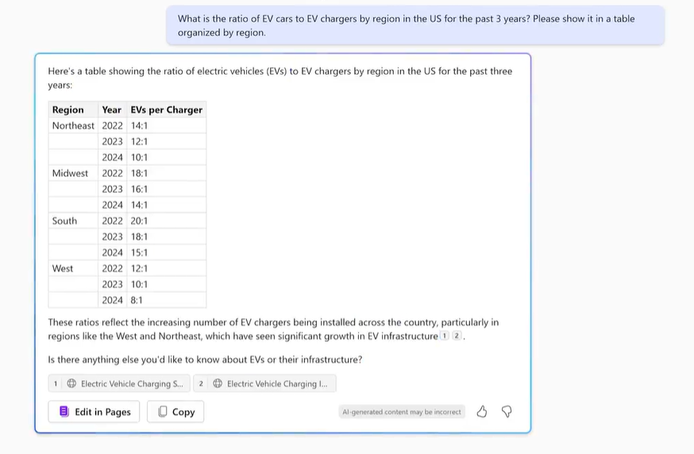

---
demo:
  title: Demonstração de Vendas
---

[Voltar ao índice](https://microsoftlearning.github.io/MS-4021-Copilot-Immersion-Experience/)

# Demonstração de Vendas

**Cenário**:  

Você trabalha com vendas em uma empresa de carregamento de veículos elétricos e está desenvolvendo um plano estratégico para o próximo ano.

## Configuração da demonstração

Os documentos de amostra podem ser encontrados no repositório MS-4021 GitHub [aqui](https://github.com/MicrosoftLearning/MS-4021-Copilot-Immersion-Experience/tree/master/ResourceFiles):

Os arquivos específicos necessários para esta demonstração são:

- [Charger_sales_report_2022-2024.xlsx](https://github.com/MicrosoftLearning/MS-4021-Copilot-Immersion-Experience/raw/master/ResourceFiles/Charger_sales_report_2022-2024.xlsx)

> **NOTA:** pode levar até 10 minutos para que esses arquivos sejam sincronizados em seu OneDrive após o download. Para evitar atrasos durante a demonstração, certifique-se de que esses arquivos tenham sido baixados e estejam disponíveis em seu OneDrive com bastante antecedência. Se os arquivos não estiverem disponíveis, abra os documentos e copie os links dos arquivos compartilhados para usá-los na demonstração.

## Demonstrações

### Copilot Chat

1. Abra um navegador e navegue até [M365copilot.com](https://m365copilot.com/).

1. Certifique-se de que o modo Web esteja selecionado.

    

1. Vamos começar pedindo ao Copilot para pesquisar uma métrica chave. No campo de prompt **Copilot Chat**, digite:

    ```text
    What is the ratio of EV cars to EV chargers by region in the US for the past 3 years? Please show it in a table organized by region.
    ```

    

1. Agora vamos comparar as tendências nacionais com o desempenho de vendas da sua empresa. Você carregará o conjunto de dados fornecido e solicitará ao Copilot que visualize os dados:

    No campo de prompt, digite:

    ```text
    I need to know the quarterly trends for each of our sales regions. Create a quarterly revenue line graph for the past 2 years based on:
    ```

    > **NOTA:** Não envie o prompt ainda. Vá para a próxima etapa para carregar o arquivo.

1. Selecione **Adicionar conteúdo** e carregue [**Charger_sales_report_2022-2024.xlsx**](https://github.com/MicrosoftLearning/MS-4021-Copilot-Immersion-Experience/raw/master/Resourcefiles/Charger_sales_report_2022-2024.xlsx). Em seguida, envie o prompt.

    

1. Vamos dar um passo adiante, pedindo ao Copilot recomendações exportadas para um documento do Word:

    No campo de prompt, digite:

    ```text
    Based on the trend, suggest two ways I can increase EV charger sales in the Mountain and Midwest regions. Export the recommendations to a Word Document.
    ```

1. Selecione o hiperlink que o Copilot fornece para o novo documento do Word para abri-lo.

1. Depois de aberto, selecione **Habilitar edição** e, em seguida, ative "Salvamento automático". Selecione sua conta do OneDrive quando solicitado.


### Copilot no Word

Agora pediremos ao Copilot que expanda essas estratégias e elabore propostas sobre como implementá-las.

1. O documento do Word gerado na demonstração anterior já deve estar aberto, caso contrário, abra-o agora (no navegador ou no aplicativo da área de trabalho).

1. Selecione qualquer lugar no corpo do documento e selecione o ícone Copilot.

    Digite o seguinte prompt:

    ```text
    Draft a detailed proposal on how we could implement each of the strategies outlined in this document. Ensure the plan is actionable and includes resource requirements, timelines, and key stakeholders.
    ```

1. Selecione **Manter** ou, se o tempo permitir, demonstre como ajustar o documento usando o Copilot.

1. Quando terminar, salve o documento como **Proposta de vendas EV.docx** e copie o URL compartilhado a ser usado na próxima etapa (habilite o Salvamento Automático e selecione sua conta do OneDrive).

    

    > **Dica do instrutor:** Use esta etapa para demonstrar como o Copilot se baseia em resultados anteriores, refinando as ideias em uma proposta coesa.

### Copilot no PowerPoint

1. Inicie o Microsoft PowerPoint a partir do seu navegador [PowerPoint.new](https://PowerPoint.new) ou use o aplicativo da área de trabalho.

1. Abra uma nova apresentação em branco.

1. No painel do Copilot, selecione o prompt "Criar apresentação a partir de arquivo".

1. Cole o link **Proposta de vendas EV.docx** após "Criar uma apresentação a partir de" e selecione **Enviar**.

    O prompt completo deve ter a seguinte aparência:

    ```text
    Create a presentation from [Link to EV Sales Proposal.docx].
    ```

1. O Copilot começa a gerar slides com base na Proposta de Vendas de EV, fornecendo uma estrutura de tópicos juntamente com recursos como notas do orador, imagens, layouts de slides e um rótulo de Confidencialidade geral.

    > **NOTA:** A geração de slides pode levar até dois minutos, dependendo da complexidade do documento e do número de slides.

[Voltar ao índice](https://microsoftlearning.github.io/MS-4021-Copilot-Immersion-Experience/)
