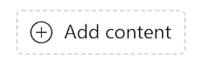

---
demo:
  title: Demonstração de Marketing
---

[Voltar ao índice](https://microsoftlearning.github.io/MS-4021-Copilot-Immersion-Experience/)

# Demonstração de Marketing

**Cenário**:  

Você está no Marketing de uma empresa de bebidas e tem como objetivo analisar as tendências do mercado, criar uma análise de marketing e desenvolver uma nova campanha para as redes sociais.

## Configuração da demonstração

Os documentos de amostra podem ser encontrados no repositório MS-4021 GitHub [aqui](https://github.com/MicrosoftLearning/MS-4021-Copilot-Immersion-Experience/tree/master/ResourceFiles):

Os arquivos específicos necessários para esta demonstração são:

- [Promotion_Plan_for_Chai_Tea_in_Latin_America.docx](https://github.com/MicrosoftLearning/MS-4021-Copilot-Immersion-Experience/raw/master/ResourceFiles/Promotion_Plan_for_Chai_Tea_in_Latin_America.docx)

- [Mystic_Spice_Premium_Chai_Tea_product_description.docx](https://github.com/MicrosoftLearning/MS-4021-Copilot-Immersion-Experience/raw/master/ResourceFiles/Mystic_Spice_Premium_Chai_Tea_product_description.docx)

- [Contoso_Chai_Tea_market_trends.docx](https://github.com/MicrosoftLearning/MS-4021-Copilot-Immersion-Experience/raw/master/ResourceFiles/Contoso_Chai_Tea_market_trends.docx)

- [Contoso_Chai_Tea_social_marketing_trends.xlsx](https://github.com/MicrosoftLearning/MS-4021-Copilot-Immersion-Experience/raw/master/ResourceFiles/Contoso_Chai_Tea_social_marketing_trends.xlsx)

> **NOTA:** pode levar até 10 minutos para que esses arquivos sejam sincronizados em seu OneDrive após o download. Para evitar atrasos durante a demonstração, certifique-se de que esses arquivos tenham sido baixados e estejam disponíveis em seu OneDrive com bastante antecedência. Se os arquivos não estiverem disponíveis, abra os documentos e copie os links dos arquivos compartilhados para usá-los na demonstração.

## Demonstrações

### Copilot no Word

Use o Copilot no Word para redigir um relatório detalhado de análise de mercado e fazer um brainstorming de ideias criativas de campanhas de marketing personalizadas para o mercado latino-americano.

1. Abra o Word (em seu navegador ou aplicativo da área de trabalho).

1. Na caixa de prompt **O que você deseja que o Copilot esboce?** digite o seguinte:

    ```text
    Create a Market Analysis report for Mystic Spice Premium Chai Tea using the attached files. Include the product description, market trend analysis, and a promotion plan for Latin America.

    [Promotion_Plan_for_Chai_Tea_in_Latin_America.docx], [Mystic_Spice_Premium_Chai_Tea_product_description.docx], [Contoso_Chai_Tea_market_trends.docx]
    ```

    > **NOTA:** Os colchetes indicam que um documento está sendo referenciado. Ao fazer referência a um documento, você pode colar o link compartilhado diretamente ou fazer referência ao nome do arquivo, se ele estiver disponível em seu OneDrive.

1. Faça com que o Copilot crie uma nova seção para adicionar ideias de campanha de mídia social:

    Digite o seguinte prompt:

    ```text
    Draft a new section for social media campaigns to promote Mystic Spice Premium Chai Tea. Include a brief description of 2-3 campaign ideas, each with a unique focus. For each campaign, provide a tagline that reflects its theme and resonates with our target audience of young professionals and tea enthusiasts.
    ```

1. Na janela do Copilot, selecione Manter para alterar o documento de um rascunho do Copilot para um documento real do Word. Salve este novo documento como **LATAM_Market_Analysis.docx**.

### Copilot Chat

Use o Copilot Chat para avaliar a eficácia das campanhas de mídia social propostas e refinar estratégias de relevância cultural no mercado LATAM.

1. Abra um navegador e navegue até [M365copilot.com](https://m365copilot.com/).

1. Certifique-se de que o modo Web esteja selecionado.

    

1. Na janela de prompt, digite o seguinte:

    ```text
    Review the social media campaigns outlined in the Market Analysis Report for Mystic Spice Premium Chai Tea.docx. Evaluate which campaign might resonate best with the LATAM market based on cultural relevance, target audience preferences, and alignment with regional trends. Provide reasons for your choice and suggest any adjustments to improve its impact.
    ```

    > **NOTA:** Não envie o prompt ainda. Vá para a próxima etapa para carregar o arquivo.

1. Selecione **Adicionar Conteúdo** e carregue o arquivo **LATAM_Market_Analysis.docx** que você salvou em seu OneDrive na demonstração anterior. Em seguida, envie o prompt.

    

1. O Copilot deve recomendar uma das campanhas a ser enfocada e fornecer sugestões de aprimoramento. No próximo prompt, queremos que o Copilot sugira um slogan de campanha de marketing para essa nova ideia:

    ```text
    Generate a catchy marketing slogan for the [Campaign name - e.g., 'Morning Motivation'] campaign that highlights its unique value proposition and resonates with the LATAM market. Ensure the slogan reflects a vibrant and culturally relevant tone that appeals to young professionals.
    ```

1. Opcionalmente, no último prompt, você pode pedir ao Copilot para gerar um novo vídeo para a campanha:

    no Copilot chat, no lado direito, selecione o **Agente do Criador Visual**:

    

    Em seguida, insira o seguinte prompt:

    ```text
    Create a captivating social media video for Mystic Spice Chai Tea that highlights its unique flavor and vibrant appeal. The video should feature eye-catching visuals, with colors, and themes that resonate with young professionals and tea enthusiasts.
    ```

### Copilot no Excel

1. Confira se você fez o download de [Contoso_Chai_Tea_market_trends_2023.xlsx](https://github.com/MicrosoftLearning/MS-4021-Copilot-Immersion-Experience/raw/master/Contoso_Chai_Tea_market_trends_2023.xlsx) e abra o documento no Excel (na Web ou no aplicativo da área de trabalho).

1. Selecione **Copilot** na faixa de opções para abrir o painel do Copilot.

1. Digite o seguinte prompt no Excel:

    ```text
    On average, how many sales do we get per social media campaign view?
    ```

1. Em seguida, peça ao Copilot para comparar as vendas com a interação na mídia social:

    ```text
    Can you show a correlation between social media engagement and sales?
    ```

1. Em seguida, digite o seguinte prompt:

    ```text
    How many social media campaign views did we have from September to December?
    ```

[Voltar ao índice](https://microsoftlearning.github.io/MS-4021-Copilot-Immersion-Experience/)
