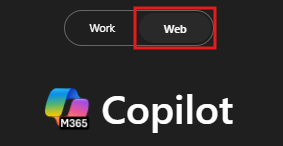

---
task:
  title: Experiência de Imersão — Comunicações
---

## Experiência de Imersão — Comunicações

Elabore uma postagem de mídia social envolvente para o lançamento de um produto real ou fictício, adaptado à sua plataforma e público.

Você realizará três tarefas:

- Pesquise plataformas de mídia social usando o **Copilot Chat**
- Faça um brainstorming de ideias de postagem usando o **Copilot chat**
- Elabore e refine sua postagem de mídia social usando o **Copilot no Word**

> **NOTA:** São fornecidos exemplos de prompts para ajudá-lo a começar. Sinta-se à vontade para personalizá-los de acordo com suas necessidades - seja criativo e explore! Se o Copilot não fornecer o resultado desejado, refine seu prompt e tente novamente. Aproveite o processo e divirta-se experimentando!

### Tarefa 1: Pesquisar plataformas de redes sociais

Utilizando o **Copilot Chat**, pesquise a plataforma de redes sociais escolhida para compreender as preferências do público, as tendências de publicação e os estilos de conteúdo eficazes. Esses insights ajudarão você a adaptar sua postagem para se alinhar às práticas recomendadas específicas da plataforma e às expectativas do público.

**Etapas:**

- Abra uma nova guia do navegador e navegue até [M365copilot.com](https://m365copilot.com/).
- Certifique-se de que a guia "modo web" esteja selecionada no Copilot Chat:

    

**Amostra de Prompt**:

```text
What types of posts perform best on [chosen social media platform]? Provide examples of tone, style, and content themes that resonate with this platform's audience.
```

> **NOTA:** Substitua [plataforma de mídia social escolhida] pela plataforma específica em que você está se concentrando, como o LinkedIn.

### Tarefa 2: Brainstorming de ideias para postagem

Utilizando o **Copilot Chat**, faça um brainstorming de ideias criativas e com engajamento para a sua publicação nas redes sociais. Considere tópicos de tendências, temas-chave para seu produto e ganchos que chamarão a atenção do seu público. Isso ajuda você a escolher uma direção atrativa para sua postagem.

**Amostra de Prompt**:

```text
What are some creative post ideas for promoting a [product or idea]? Focus on engaging, shareable, and platform-specific themes.
```

> **NOTA:** Substitua [produto ou ideia] por um produto real ou fictício de sua escolha.

> **DICA**  
>
> - Peça ao Copilot para exportar a resposta para um documento do Word para salvar para uso futuro. Salve o documento em seu OneDrive e copie o URL compartilhado.
> - Para copiar o link, abra o documento do Word salvo e selecione **Compartilhar** > **Copiar Link**, conforme mostrado abaixo:  
> 

### Tarefa 3: Elaborar e aperfeiçoar a sua publicação nas redes sociais

Utilizando o **Copilot no Word**, elabore uma publicação concisa e com engajamento nas redes sociais com base na sua pesquisa e brainstorming. Refine a postagem para alinhá-la ao estilo da sua plataforma e garantir que ela comunique sua mensagem de forma clara e eficaz.

**Etapas:**

- Inicie o Microsoft Word a partir do seu navegador [word.new](https://word.new) ou use o aplicativo da área de trabalho.
- Digite seu prompt onde diz **"Descreva o que você gostaria de escrever"**.

    

**Amostra de Prompt**:

```text
Write a short and engaging social media post about [product or idea]. Make it clear, attention-grabbing, and aligned with the platform's style.
```

> **NOTA:** Substitua [produto ou ideia] por um produto real ou fictício de sua escolha.

> **DICA** Ao redigir sua publicação nas mídias sociais, use o link do documento compartilhado da Tarefa 2 para fazer referência aos insights chave. Como alternativa, digite "/" no Copilot para referenciar e inserir rapidamente arquivos relevantes do OneDrive.
