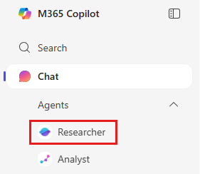
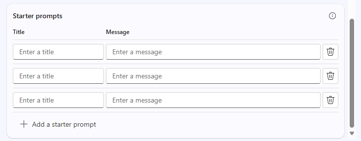

---
task:
  title: Experiência de imersão – agentes (executivos)
---

## Experiência de imersão – agentes (executivos)

Explore como Microsoft 365 Copilot e o Copilot Studio podem ajudar a resolver um desafio real relacionado ao trabalho criando um **agente simples baseado em recuperação**. Este exercício explicará como identificar um problema, dividi-lo, explorar em que a IA pode ajudar e então criar um agente conceitual para resolvê-lo.  

Você executará quatro tarefas:

- Identificar um problema relacionado ao trabalho  
- Dividir o problema e explorar em que a IA pode ajudar  
- Usar o **Pesquisador** para descobrir ideias e ideias de solução  
- Conceitualizar e simular um agente baseado em recuperação no **Copilot Studio**  

> **Observação:** os prompts de exemplo são fornecidos para ajudar você a começar. Fique à vontade para personalizá-los conforme a sua situação. 
>
> Se você quiser ajuda para gerar ou refinar prompts, tente o <a href="https://appsource.microsoft.com/en-us/product/office/WA200007578" target="_blank">agente do Treinador de prompts</a><br>, que pode sugerir, melhorar e avaliar prompts para que você obtenha resultados melhores com o Copilot.

### Tarefa 1: Identificar um desafio relacionado ao trabalho  

Comece pensando em um problema real que você encontra em sua função. Algo que deixa você mais lento ou dificulta o acesso às informações. Você pode refletir individualmente ou usar o **Copilot Chat** como parceiro para ajudar a gerar ideias e identificar um desafio em que recuperar e organizar o conhecimento faria a diferença.  

Para orientar seu pensamento, considere:  

- **O que está funcionando bem hoje**  
- **O que não está funcionando bem**  
- **Em que a IA *pode* conseguir ajudar**  

**Etapas:**  

- Abra uma nova guia do navegador e vá para [m365.cloud.microsoft/chat](https://m365.cloud.microsoft/chat).  
- A guia **Modo de trabalho** deve estar selecionada no **Copilot Chat**:  

     

    **Exemplo de prompt:**

   ```text
   I’m researching common day-to-day issues I face at work, such as processes, collaboration, or time management. Look at recent conversations from [Teams chats, Outlook emails, or other collaboration tools] related to [your role focus]. Summarize the key issues or pain points mentioned in the last 6 months. Show the results in a table with:  

    - Title: Short label for the issue  
    - Description: Brief summary of the challenge  
    - Frequency: How often it comes up (e.g., number of mentions)
   ```

### Tarefa 2: Dividir o problema

Usando o **Copilot Chat**, use o desafio identificado na Tarefa 1 e divida-o em partes menores:

- O que torna esse problema difícil?  
- Onde as informações ficam presas ou perdidas?  
- Quem é mais afetado?  

    **Prompt de exemplo (Copilot Chat – Modo de Trabalho):**

    ```text
    Break down the problem of [insert challenge]. Identify root causes, pain points, and which areas of work are most affected.
    ```

    > **TIP:** pense em que ponto a recuperação de conhecimento pouparia tempo ou ajudaria sua equipe a tomar decisões mais rápidas.

### Tarefa 3: Explore as ideias de solução de IA com o Pesquisador

Use o **Agente Pesquisador** para ver como o Copilot e os agentes podem ajudar. Concentre-se em soluções que recuperam, organizam ou resumem o conhecimento, não automatizam tarefas. 

**Etapas:**

- Abra uma nova guia do navegador e vá para [m365.cloud.microsoft/chat](https://m365.cloud.microsoft/chat).
- No menu do Copilot Chat, expanda **Agentes** e selecione **Pesquisador**  

      

    **Prompt de exemplo (Agente Pesquisador):**

    ```text
    Explore possible AI solutions to address [insert problem]. Focus on retrieval-based approaches using Microsoft Copilot, Copilot Studio agents, or connected knowledge sources. Summarize three possible solution approaches, their benefits, and limitations.
    ```

    > **TIP:** procure oportunidades em que um agente possa facilitar a localização, a reutilização ou o compartilhamento de conhecimento.

    > **Observação:** o pesquisador pode levar 5–10 minutos para concluir, dependendo da sua solicitação. Suas respostas são altamente detalhadas, portanto, durante a operação, tente executar o mesmo prompt no Copilot Chat. Comparar os dois resultados é uma ótima maneira de ver como cada ferramenta aborda a tarefa.

### Tarefa 4: Conceitualizar seu agente

Agora, obtenha seus insights e crie um agente fictício simples no **Copilot Studio**. Mantenha o foco na recuperação. Seu agente deve ajudar a exibir, organizar ou resumir informações.

**Etapas:**

- **Iniciar no Copilot Studio**

    1. Abra o navegador e vá para [m365.cloud.microsoft/chat](https://m365.cloud.microsoft/chat).
    1. Selecione **Criar agente** no trilho direito para iniciar o **Copilot Studio**.

        

- **Definir seu Agente (guia Descrever ou Guia Configurar)**

    1. Escolha a guia **Descrever** e use este prompt de exemplo (ou escreva seu próprio):

        ```text
        You’re a virtual assistant for our [project/team name]. Your role is to help with [key tasks]. Be concise, stay on-brand, and reference our shared resources when possible.
        ```

        

        > **Observação:** você pode começar do zero ou basear seu agente em um modelo, que preenche previamente as configurações e as instruções que você pode personalizar depois.

    1. Se a opção **Descrever** não estiver disponível, alterne para a guia **Configurar** e insira os mesmos detalhes manualmente: nome, descrição e instruções do agente.

        

- **Personalizar seu Agente**

    Na guia **Configurar**, explore estas opções:

    1. Adicione pelo menos uma fonte de conhecimento (por exemplo, um documento salvo no OneDrive/SharePoint ou seus emails).

        

    1. Defina os prompts de início para ajudar outras pessoas a começar a usar seu agente

        

        > **TIP:** Os prompts de início ajudam a orientar os usuários sobre como interagir com o agente.

- **Testar e criar**

    1. Use o recurso **Testar** (disponível no painel direito em todo o processo de criação de agente) para testar seu agente de rascunho e refinar problemas.
    2. Quando estiver satisfeito, selecione **Criar** para publicar o agente.
    3. Compartilhe seu agente com outras pessoas ou abra-o para uso imediato.  

> **TIP:** a meta não é criar um agente perfeito hoje: é explorar como os agentes focados em recuperação podem facilitar o acesso ao conhecimento em seu trabalho diário.
